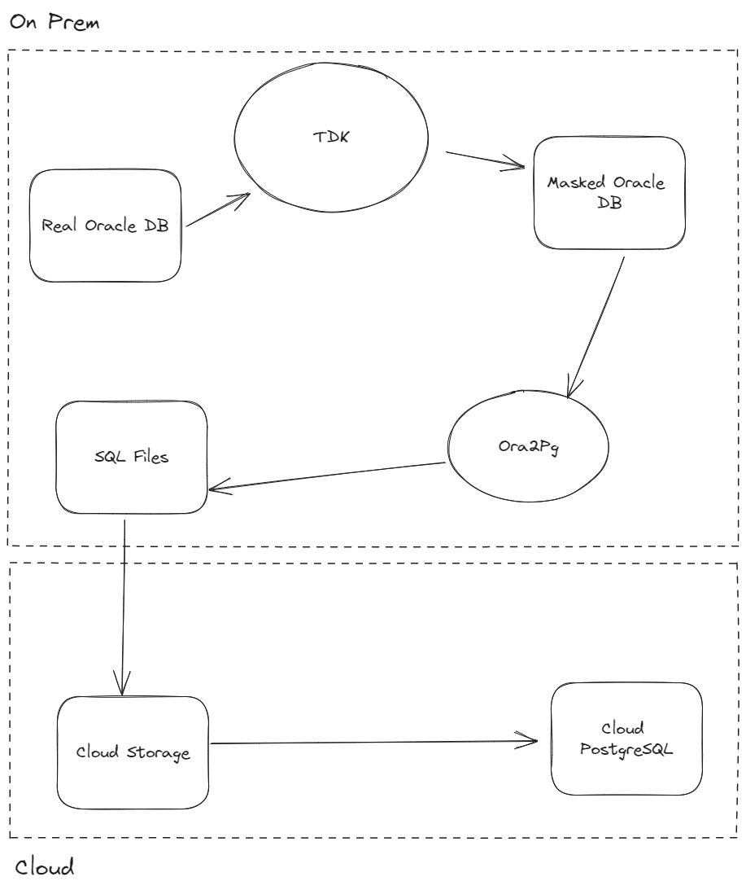

# tdk-ora2pg-demo

### Steps

1. Set up the license key:
```
export SYNTHESIZED_KEY=kDpeQB...
```

2. Spin up Oracle databases:
```
docker-compose up oracle_source oracle_target -d
```

3. Run TDK:
```
docker-compose run tdk
```

4. Run ora2pg to export the masked Oracle database to set of PostgreSQL sql-files:
```
docker-compose run ora2pg
```

5. Run the PostgreSQL database:
```
docker-compose up postgres_masked -d
```

### Data flow diagram




### Knowing problems

- get rid of `last_update` columns in the cofiguration file
- truncate shcema with recursive FKs
- mask the `film.description` column
